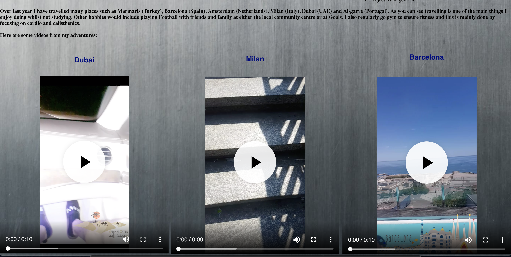

# Website
This website I created is a simple design and has the purpose to outline and endorse myself on a website platform, showing my attributes, education and experience. This enhancing my brand image on a wider platform and is something which I look to maintain and potentially re-design and update as time goes on.

This website is compatible for both mobile and desktop and has features multi-purpose entwined with user behaviour, allowing there to be a better experience whilst browsing. With videos, API’s, and decorative information it looks to keep the user intrigued and concentrated on the content.

There have been consistent commits from when the assignment brief was distributed, the continuous change since then has allowed my website to develop and be compatible on a multiscreen basis. There are many ways I could look to improve the website itself and would look to elaborate further below.

## Mock-up Designs (pre-development)
The following designs are a pre-development designs and may not be completely identical to the website but was used as guide line and made to assist the design.
###

###

## Testing
This section includes testing on both mobile and desktop platforms, with views of  the pages to see how well they function. The website has been tested multiple times on various different mobile and desktop platforms. Here are the platforms tested:
- iPhoneXSmax
- Samsung Galaxy Note 9
- iPhone 6s
- Macbook pro
- imac

### Desktop
The following screenshots are of the Desktop view of the pages.
###
**Index**

###
**Home**

###
**About**

###

###
**Education**

###

###
**Work**

###

###
**Contact**

### Mobile
The following screenshots are of the Mobile view of the pages.
###
**Index**

###
**Home**

###
**About**

###
**Education**

###
**Work**

###
**Contact**

### imac
**About**

###
### Samsung Galaxy Note 9
**Work**

## Sitemap & Tree-Structure
The following screenshots show both a tree structure for my website and also a sitemap of it. The tree structure outlines the root nodes and its child nodes underneath it and the links between them. The sitemap shows a XML mark up version used from google optimisation, the xml generator provided a live location of the website.
###
**Tree-Structure**

###
**Sitemap**

## Validation
###
[Index HTML](https://validator.w3.org/nu/?doc=https%3A%2F%2Fctec3905.github.io%2Fwebsite-momotaib.github.io%2Findex.html)
###
[Index CSS](https://jigsaw.w3.org/css-validator/validator?uri=https%3A%2F%2Fctec3905.github.io%2Fwebsite-momotaib.github.io%2Findex.html&profile=css3svg&usermedium=all&warning=1&vextwarning=&lang=en)
###
[Home HTML](https://validator.w3.org/nu/?doc=https%3A%2F%2Fctec3905.github.io%2Fwebsite-momotaib.github.io%2Findex.html)
###
[Home CSS](https://jigsaw.w3.org/css-validator/validator?uri=https%3A%2F%2Fctec3905.github.io%2Fwebsite-momotaib.github.io%2Fhome.html&profile=css3svg&usermedium=all&warning=1&vextwarning=&lang=en)
###
[About HTML](https://validator.w3.org/nu/?doc=https%3A%2F%2Fctec3905.github.io%2Fwebsite-momotaib.github.io%2Fabout.html)
###
[About CSS](https://jigsaw.w3.org/css-validator/validator?uri=https%3A%2F%2Fctec3905.github.io%2Fwebsite-momotaib.github.io%2Fabout.html&profile=css3svg&usermedium=all&warning=1&vextwarning=&lang=en)
###
[Education HTML](https://validator.w3.org/nu/?doc=https%3A%2F%2Fctec3905.github.io%2Fwebsite-momotaib.github.io%2Feducation.html)
###
[Education CSS](https://jigsaw.w3.org/css-validator/validator?uri=https%3A%2F%2Fctec3905.github.io%2Fwebsite-momotaib.github.io%2Feducation.html&profile=css3svg&usermedium=all&warning=1&vextwarning=&lang=en)
###
[Work HTML](https://validator.w3.org/nu/?doc=https%3A%2F%2Fctec3905.github.io%2Fwebsite-momotaib.github.io%2Fwork.html)
###
[Work CSS](https://jigsaw.w3.org/css-validator/validator?uri=https%3A%2F%2Fctec3905.github.io%2Fwebsite-momotaib.github.io%2Fwork.html&profile=css3svg&usermedium=all&warning=1&vextwarning=&lang=en)
###
[Contact HTML](https://validator.w3.org/nu/?doc=https%3A%2F%2Fctec3905.github.io%2Fwebsite-momotaib.github.io%2Fcontact.html)
###
[Contact CSS](https://jigsaw.w3.org/css-validator/validator?uri=https%3A%2F%2Fctec3905.github.io%2Fwebsite-momotaib.github.io%2Fcontact.html&profile=css3svg&usermedium=all&warning=1&vextwarning=&lang=en)

## Future Work
I have many aspirations in the future and look to use my website as a tool to endorse myself to businesses and institutions. I would look to ensure that I can improve any bugs and fixes needed with the website and clear out as much as I can. I would also look to re-design the whole website and have a different view to it. I could also look to have more experience so I can continue to update the website as I go.

In the future I may also look to add user behaviour to every single page and keep the user intrigued as I go on. I will provide more information and try to style it in different ways which will appeal to different target audiences.

## References

Anon, (n.d.). [image] Available at: https://www.kisscc0.com/png/iphone-computer-icons-apple-telephone-call-phone-i-dxdjp8/ [Accessed 1 Dec. 2018].

Anon, (n.d.). [image] Available at: http://www.transparentpng.com/cats/facebook-logo-1901.html [Accessed 30 Nov. 2018].

Anon, (n.d.). [image] Available at: https://www.freeiconspng.com/images/linkedin-logo-png [Accessed 30 Nov. 2018].

Anon, (n.d.). [image] Available at: http://people.csail.mit.edu/spillai/icons/github.png [Accessed 30 Nov. 2018].

Anon, (n.d.). [image] Available at: http://www.stickpng.com/img/icons-logos-emojis/tech-companies/instagram-logo [Accessed 30 Nov. 2018].

Anon, (n.d.). [image] Available at: https://readforgood.org/leicester/highfields-primary-school-trio-leicester-2018/ [Accessed 14 Nov. 2018].

Anon, (n.d.). [image] Available at: https://www.hastingsdirectcareers.com/application/files/5515/0516/9596/Hastings_Direct_Leicester.jpg [Accessed 14 Nov. 2018].

Anon, (n.d.). [image] Available at: https://images.unsplash.com/photo-1530570094090-deefc82ab21c?ixlib=rb-0.3.5&q=85&fm=jpg&crop=entropy&cs=srgb&ixid=eyJhcHBfaWQiOjE0NTg5fQ&s=fdbb180649d7742e5b58cc8a7c9b6288 [Accessed 2 Nov. 2018].

Moshaz, (2015). [image] Available at: https://www.facebook.com/moshazstages/photos/a.602987449740503/1008394005866510/?type=3&theater [Accessed 14 Nov. 2018].

Unite, Group, (2018). [image] Available at: https://twitter.com/unitegroup [Accessed 14 Nov. 2018].

Anon, (2017). [image] Available at: https://www.pexels.com/photo/black-and-white-gray-grey-smooth-1050305/ [Accessed 29 Oct. 2018].

Anon, (n.d.). [image] Available at: http://www.cityleicester.co.uk/ [Accessed 14 Nov. 2018].

Anon, (n.d.). [image] Available at: https://www.google.co.uk/url?sa=i&source=images&cd=&cad=rja&uact=8&ved=2ahUKEwjjzI6cv8DeAhURxxoKHe1rBgcQjRx6BAgBEAU&url=https%3A%2F%2Funiversity.which.co.uk%2Fde-montfort-university-d26&psig=AOvVaw2fTlAWoSSnhNiXMjMeB2yi&ust=1541606866984285 [Accessed 13 Nov. 2018].

Anon, (n.d.). [image] Available at: https://www.brainyquote.com/quotes/unknown_159550 [Accessed 6 Nov. 2018].

Anon, (2018). [image] Available at: https://www.freeiconspng.com/img/99 [Accessed 30 Nov. 2018].
